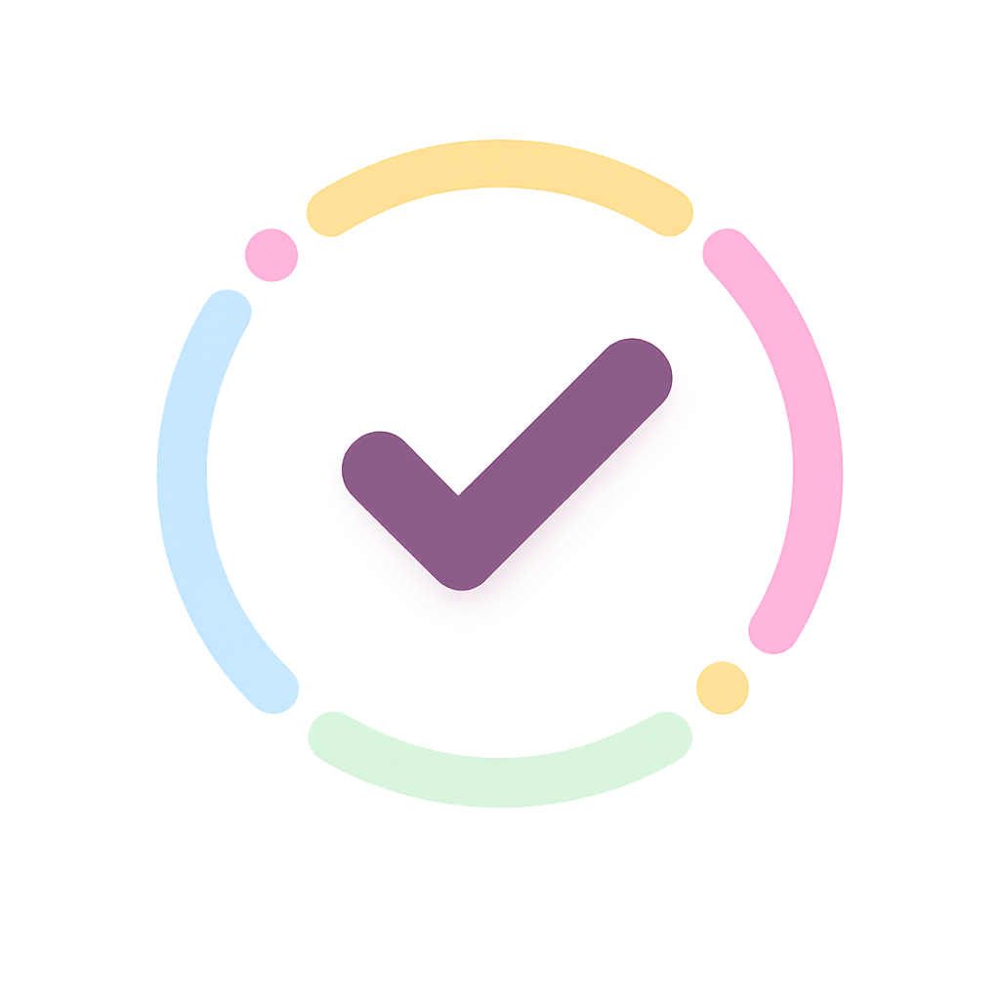
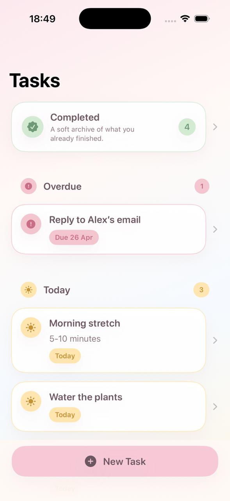
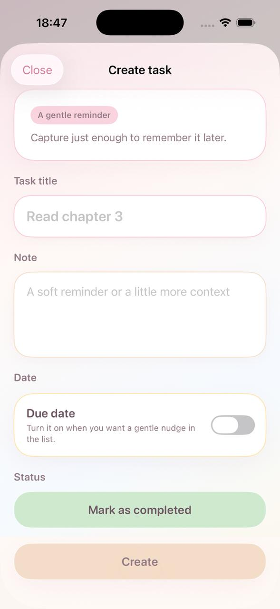
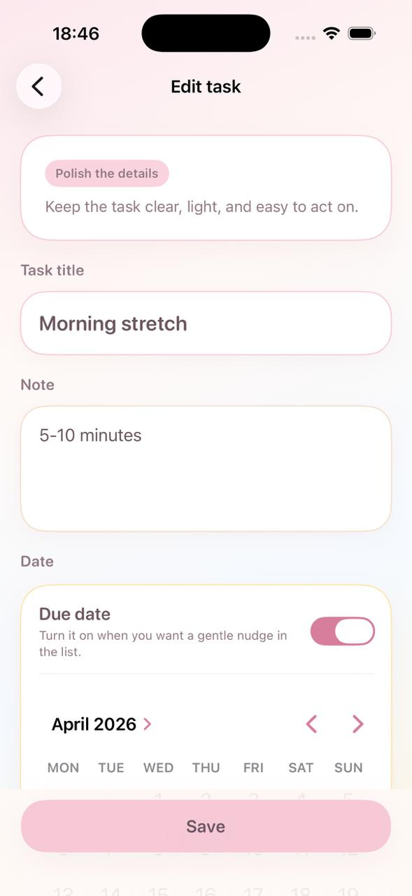
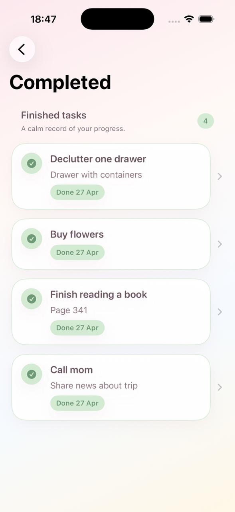
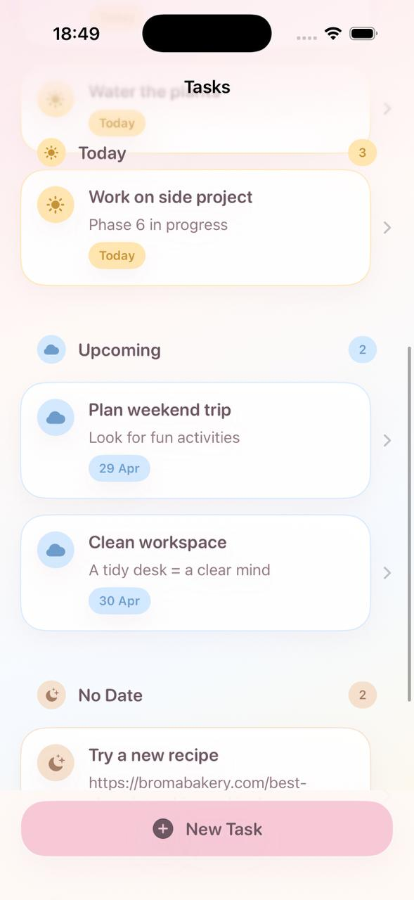

# Vimlo

<p align="center">
  
</p>

<p align="center">
  <strong>Vimlo</strong> is a calm, minimalist iOS task tracker designed for personal daily planning. It helps users capture tasks quickly, organize them by urgency, and complete them without the friction of a heavyweight productivity system.
</p>

---

## 📱 Screenshots

<table>
  <tr>
    <td align="center">
      
      <br />
      <strong>Home</strong>
    </td>
    <td align="center">
      
      <br />
      <strong>Create Task</strong>
    </td>
    <td align="center">
      
      <br />
      <strong>Edit Task</strong>
    </td>
  </tr>
  <tr>
    <td align="center">
      
      <br />
      <strong>Completed Archive</strong>
    </td>
    <td align="center">
      
      <br />
      <strong>Sectioned Task List</strong>
    </td>
    <td align="center"></td>
  </tr>
</table>

---

## ✨ Features

* Create tasks with a required title plus optional note and due date
* Organize active tasks into `Overdue`, `Today`, `Upcoming`, and `No Date`
* Edit, delete, complete, and reactivate tasks through lightweight flows and swipe actions
* Keep completed tasks in a dedicated archive, separated from the active list
* Persist data locally with `SwiftData` for an offline-first experience
* Provide polished empty states and a soft, approachable visual design

---

## 🛠 Tech Stack

* Language: `Swift 5`
* UI: `SwiftUI`
* Architecture: `MVVM` with feature-first folder organization
* Persistence: `SwiftData`
* Networking: None in MVP, by design
* Other: `NavigationStack`, `sheet` presentation, `@Observable`, `@Query`, custom theming, date normalization with `Calendar`

---

## 🏗 Architecture

Vimlo uses a lightweight `MVVM` structure because it keeps SwiftUI views focused on presentation while moving grouping, validation, and task mutations into dedicated view models and services. That makes the app easier to reason about today and easier to extend later with reminders, recurring tasks, or sync.

The codebase is structured around feature modules:

* Presentation Layer: SwiftUI screens and reusable UI components in `Features/Home`, `Features/TaskEditor`, and `Features/Completed`
* Domain / Interaction Layer: view models plus `TaskActions`, which centralizes task mutations such as complete, reactivate, and delete
* Data Layer: the `Task` `@Model` backed by `SwiftData` and injected through the app-level `ModelContainer`

Key design decisions:

* Time-based sections are derived from `dueDate` instead of stored as redundant state
* Due dates are normalized to the start of the day to keep grouping predictable
* The app stays intentionally offline-first and single-device in MVP to reduce complexity and sharpen the core user flow

---

## 📘 Product Thinking

This MVP was shaped with a documentation-driven approach: product goals, user flows, MVP scope, and implementation decisions were defined before and during development. That helped keep the app focused on a clear core loop instead of growing into a generic feature-heavy to-do list.

---

## 🚀 Getting Started

### Requirements

* iOS `26.4+` simulator or device support, based on the current project configuration
* Xcode with support for `SwiftUI` and `SwiftData`

### Installation

1. Clone the repository:
   ```bash
   git clone https://github.com/emshmidt/Vimlo.git
   ```

2. Open the project:
   ```bash
   cd Vimlo
   open Vimlo.xcodeproj
   ```

3. Build and run in Xcode

---

## 🎬 Demo

The screenshots above cover the main product flow: viewing grouped active tasks, creating a task, editing it, and reviewing completed items. A short GIF walkthrough or TestFlight build would be a strong next addition for public presentation.

---

## 🤔 Motivation

This project was created to explore a calmer approach to personal task management: something lighter than a full project manager, but more intentional than a plain checklist.

It also serves as a portfolio piece that demonstrates:

* product thinking from PRD to implementation
* clean SwiftUI architecture for a real MVP
* local-first persistence and user-focused interface design

---

## ⚡ Challenges & Solutions

* Challenge: keeping task sections intuitive without storing extra status fields. Solution: derive `Overdue`, `Today`, `Upcoming`, and `No Date` dynamically from normalized due dates.
* Challenge: supporting the full CRUD lifecycle without making the app feel heavy. Solution: keep one primary home surface, use a lightweight create/edit flow, and separate completed tasks into their own archive.
* Challenge: building an MVP that is useful immediately and still extensible. Solution: use `SwiftData` for local persistence, keep explicit task timestamps and identity, and isolate mutations in a small service layer.

---

## 🔮 Roadmap

Planned improvements:

* Local reminders
* Recurring tasks
* Home Screen widgets
* More flexible sorting and display preferences
* Cross-device sync in a future post-MVP iteration

---

## 🧪 Testing

* Unit Tests: Starter `XCTest` setup is in place with a small initial suite covering task validation, date normalization, task grouping, and completion state updates
* Build status: The current unit tests compile successfully as part of the test target setup
* UI Tests: Not yet
* Current validation: manual testing of create, edit, delete, complete, reactivate, and persistence flows

---

## 📂 Project Structure

```text
.
├── README.md
├── LICENSE
├── Vimlo
│   ├── App
│   ├── Assets.xcassets
│   ├── Features
│   │   ├── Completed
│   │   ├── Home
│   │   └── TaskEditor
│   ├── Models
│   └── Services
├── Vimlo.xcodeproj
└── docs
    └── screenshots
```

---

## 🔄 CI/CD

CI/CD is not configured yet for this MVP. A practical next step would be adding `GitHub Actions` to run build checks and automated tests on pull requests.

---

## 📄 License

This project is licensed under the MIT License. See the [LICENSE](LICENSE) file for details.

---

## 📬 Contact

* GitHub: [@emshmidt](https://github.com/emshmidt)
* Telegram: [@em_shmidt](https://t.me/em_shmidt)
* Email: [shmidt.em.23@gmail.com](mailto:shmidt.em.23@gmail.com)
